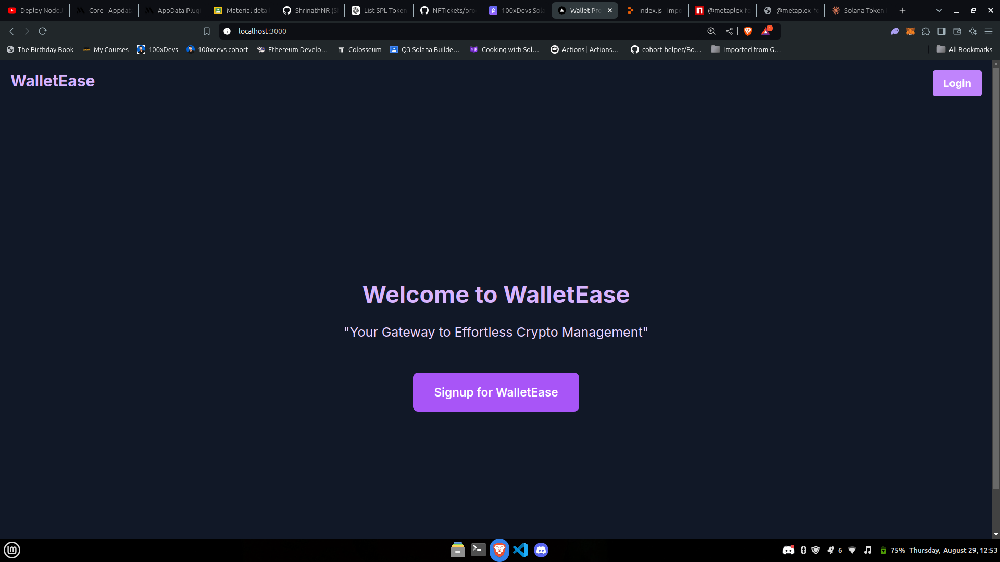
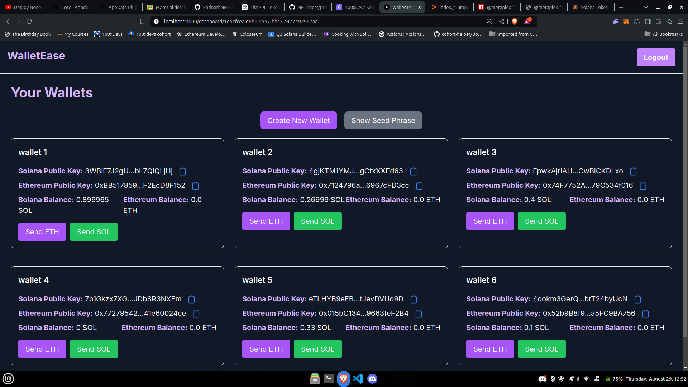

# Wallet Provider

This is a web based hd wallet provider that associates your wallets to your google account, you can send receive eth/sol and view balances as of now.


## Demo

You can view the live demo of the application here: [Demo Link](https://www.loom.com/share/8a07b265aab54163876cf2e40b06d366)

## Screenshots

### Login Page



### Dashboard Page



---

## Table of Contents

- [Getting Started](#getting-started)
- [Setup](#setup)
- [Running the Project](#running-the-project)
- [Demo](#demo)
- [Screenshots](#screenshots)

## Getting Started

Follow these instructions to set up the project locally.

### Prerequisites

Make sure you have the following installed:

- Node.js (v14.x or later)
- npm (v6.x or later)
- PostgreSQL (a running instance of PostgreSQL)
- A Google account for OAuth setup

## Setup

1. **Clone the repository:**

   ```bash
   git clone https://github.com/Allen-Saji/wallet-provider.git
   ```

2. **Navigate to the project directory:**

   ```bash
   cd wallet-provider
   ```

3. **Install the dependencies:**

   ```bash
   npm install
   ```

4. **Setup the environment variables:**

   - Create a `.env` file in the root directory.
   - Refer to `.env.example` for the necessary environment variables.

   ```env
   DATABASE_URL=your_postgres_connection_string
   NEXT_PUBLIC_GOOGLE_CLIENT_ID=your_google_client_id
   GOOGLE_CLIENT_SECRET=your_google_client_secret
   ```

5. **Generate the Prisma client:**

   ```bash
   npx prisma generate
   ```

6. **Run the development server:**

   ```bash
   npm run dev
   ```

   The application will start running on `http://localhost:3000`.

## License

This project is licensed under the MIT License - see the [LICENSE.md](LICENSE.md) file for details.

## Contact

For more information, contact [Allen Saji](mailto:your-email@example.com).
